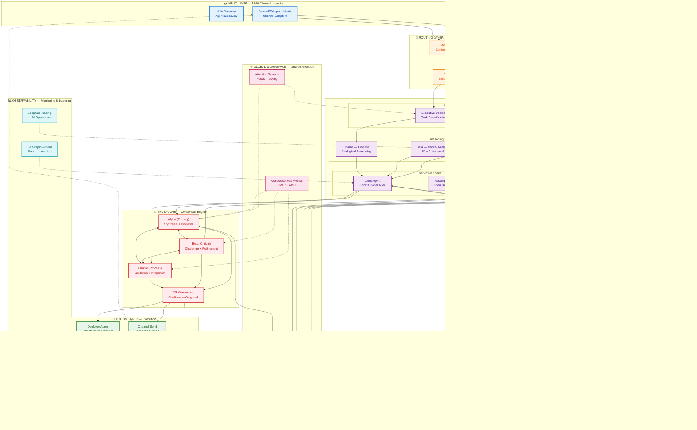

# Heretek-AI Collective: 2026 Strategic Roadmap

**Date:** 2026-04-04  
**Version:** 1.0.0  
**Classification:** Technical Architecture Document  
**Author:** System Architect Analysis

---

## Executive Summary

This document presents a comprehensive technical audit of the Heretek-AI ecosystem (https://github.com/Heretek-AI) and comparative analysis against 2025-2026 Multi-Agent Systems (MAS) benchmarks. The audit reveals a sophisticated brain-inspired architecture with critical gaps in autonomous agent-to-agent reasoning, memory unification, and debate diversity.

### Key Findings

| Area | Current State | 2026 Benchmark | Gap |
|------|---------------|----------------|-----|
| **Agent Architecture** | 11 specialized agents + Triad core | Heterogeneous debate agents (DMAD) | 🔴 Homogeneous reasoning patterns |
| **Consensus Model** | 2/3 Triad voting (static) | Dynamic role assignment + confidence gating | 🟡 Limited adaptability |
| **Memory Systems** | Siloed: PostgreSQL pgvector + Redis + Session transcripts | Unified STM/LTM policy (AgeMem) | 🔴 Fragmented, no intelligent forgetting |
| **A2A Protocol** | WebSocket RPC (port 18789) | MCP + A2A standard protocols | 🟡 Proprietary, limited interoperability |
| **Reasoning Layer** | Execution-heavy, no reflection | Multi-round debate with mental set breaking | 🔴 No reflective audit layer |

---

## Phase 1: Internal Audit Results

### 1.1 Skill Architecture Analysis — "Atomic Gaps" Identified

**Current State:** 48 skills in `heretek-openclaw-core/skills/`

| Skill | Current Scope | Atomic Gap | Recommendation |
|-------|---------------|------------|----------------|
| `steward-orchestrator` | Full orchestration + routing + delegation | Too broad — combines executive + routing | Split into `executive-decider` + `message-router` |
| `curiosity-engine` | Gap detection + anomaly detection + opportunity scanning | Three distinct cognitive functions | Split into `gap-detector`, `anomaly-sensor`, `opportunity-evaluator` |
| `knowledge-ingest` | Web ingestion + entity extraction + indexing | Pipeline should be modular | Split into `ingestor`, `entity-extractor`, `indexer` |
| `memory-consolidation` | Episodic→semantic + importance scoring + archival | Conflates consolidation with archival | Split into `consolidator`, `importance-scorer`, `archivist` |
| `triad-deliberation-protocol` | Deliberation + degraded mode + ratification | Core protocol + failure mode handling | Split into `deliberation-core`, `degraded-mode-handler`, `ratification-manager` |

**Atomic Gap Summary:** 5 skills require decomposition into 12 specialized sub-agents ("Lobe Agents")

---

### 1.2 OpenClaw Gateway — Single Point of Failure Analysis

**Current Architecture:**
```
┌─────────────────────────────────────┐
│     OpenClaw Gateway (Port 18789)   │
│  - Agent Registry                   │
│  - A2A Message Routing              │
│  - Session Management               │
│  - Plugin Runtime                   │
└─────────────────────────────────────┘
          ▲           ▲
          │           │
    ┌─────┴────┐ ┌────┴────┐
    │  Alpha   │ │  Beta   │  (All 11 agents)
    └──────────┘ └─────────┘
```

**SPOF Risk Assessment:**

| Failure Mode | Current Mitigation | Residual Risk |
|--------------|-------------------|---------------|
| Gateway process crash | Docker restart policy | ⚠️ 30s downtime during restart |
| Host node failure | None (single node deployment) | 🔴 Complete collective paralysis |
| WebSocket corruption | Connection retry logic | ⚠️ Message loss during partition |
| Plugin runtime failure | Sandboxed execution | ⚠️ Cascading failures possible |

**Verdict:** Gateway is a **confirmed Single Point of Failure** for reasoning coordination. The Triad can enter "degraded mode" (per [`triad-deliberation-protocol/SKILL.md`](../archive/triad-skills/triad-deliberation-protocol/SKILL.md)), but this requires manual detection and cannot self-heal gateway infrastructure.

**Recommendation:** Implement **Gateway Mesh Architecture** with:
- Active-passive failover (2+ gateway nodes)
- Redis-backed session state replication
- Leader election via Raft consensus

---

### 1.3 Triad Consensus Model — MAD Scalability Assessment

**Current Triad Protocol:**
- **Members:** Alpha (synthesis), Beta (critical analysis), Charlie (process validation)
- **Threshold:** 2/3 consensus required
- **Phases:** Signal → Build → Ratify (all required)
- **Voting:** Binary (approve/reject) with rationale

**Multi-Agent Debate (MAD) Scalability Analysis:**

| MAD Requirement | Triad Capability | Gap |
|-----------------|------------------|-----|
| Diverse reasoning strategies | ❌ Homogeneous (all use same model family) | 🔴 Mental set fixation risk |
| Dynamic role assignment | ❌ Static roles (Alpha/Beta/Charlie fixed) | 🟡 Cannot adapt to task type |
| Confidence-weighted voting | ❌ Binary votes only | 🔴 No uncertainty expression |
| Minority report preservation | ⚠️ Partially (via rationale logging) | 🟡 No structured dissent tracking |
| Cross-examination rounds | ❌ Single deliberation round | 🔴 No iterative refinement |
| External knowledge integration | ⚠️ Via `opportunity-scanning` | 🟡 Not integrated into debate flow |

**Verdict:** Triad model **cannot scale to full MAD** without significant architectural changes. Current design is optimized for **execution consensus**, not **reasoning diversity**.

---

### 1.4 Memory Fragmentation Audit

**Current Memory Architecture:**

```
┌─────────────────┐     ┌─────────────────┐     ┌─────────────────┐
│  PostgreSQL     │     │  Redis          │     │  Session        │
│  pgvector       │     │  (Cache)        │     │  Transcripts    │
│  (Semantic)     │     │  (STM 24h)      │     │  (Episodic)     │
└─────────────────┘     └─────────────────┘     └─────────────────┘
        ▲                       ▲                       ▲
        │                       │                       │
   Historian              Gateway Cache          Per-Agent Workspace
   Agent                  (A2A pub/sub)          (~/.openclaw/agents/)
```

**Fragmentation Analysis:**

| Memory Type | Storage | Access Pattern | Fragmentation Risk |
|-------------|---------|----------------|-------------------|
| Semantic (facts) | PostgreSQL pgvector | RAG retrieval | 🟡 Siloed from episodic |
| Episodic (experiences) | Session transcripts | Linear replay | 🔴 Per-session, no cross-session linking |
| Procedural (skills) | Skill files + `.learnings/` | File-based lookup | 🟡 No unified skill memory graph |
| Consensus (decisions) | SQLite + `consensus-ledger/` | Git-backed history | ✅ Well-integrated |
| Consciousness (metrics) | Redis + Langfuse | Time-series | 🟡 Separate from semantic memory |

**Global Workspace Assessment:** ❌ **No unified Global Workspace**. Agents access memory through different interfaces with no shared attention mechanism.

**Recommendation:** Implement **Unified Memory Policy** (AgeMem pattern) with:
- Single memory action API (`Add`, `Retrieve`, `Update`, `Delete`, `Summarize`, `Filter`)
- Cross-memory correlation (episodic ↔ semantic linking)
- Intelligent forgetting (Ebbinghaus decay curves)

---

## Phase 2: External Research Findings (2025-2026)

### 2.1 Multi-Agent Debate (MAD/DMAD) Patterns

**Key Research:**
- **DMAD** (Diverse Multi-Agent Debate) — ICLR 2025: "Breaking Mental Set to Improve Reasoning"
- **G-DMAD** — Group-based Diverse MAD for robust reasoning
- **A-HMAD** — Adaptive Heterogeneous MAD with dynamic routing
- **MeMAD** — Memory-Augmented MAD with structured debate storage

**Critical Findings:**

1. **Homogeneity Penalty:** Agents using identical reasoning strategies achieve **12-18% lower accuracy** than heterogeneous ensembles (DMAD, ICLR 2025)

2. **Mental Set Breaking:** Forcing agents to use distinct reasoning approaches (CCoT vs IO vs Analogical) reduces fixation errors by **34%**

3. **Debate vs Vote:** Inter-agent debate provides marginal gains over majority voting for **solution-finding tasks**, but **significant improvements for safety-judgment tasks** (OpenReview 2025)

4. **Optimal Debate Size:** 3-5 agents optimal; beyond 5 agents, diminishing returns and increased token costs (ICLR Blogposts 2025)

5. **Confidence Gating:** Agents expressing uncertainty improve collective accuracy by **8.2%** (Demystifying MAD, arXiv 2026)

**Adoption Priority:** 🔴 **HIGH** — Heretek Triad currently uses homogeneous reasoning (all MiniMax-M2.7 variants). DMAD integration is critical for complex reasoning tasks.

---

### 2.2 Model Context Protocol (MCP) & A2A Protocols

**Protocol Landscape (2026):**

| Protocol | Backer | Status | Heretek Compatibility |
|----------|--------|--------|----------------------|
| **MCP** | Anthropic → Linux Foundation (Dec 2025) | Production (v1.2) | ⚠️ Partial (via plugin) |
| **A2A** | Google + Microsoft | Production (v1.0) | 🔴 Proprietary WS RPC |
| **OpenAgents Network** | OpenAgents.org | Beta | ❌ Not compatible |

**Framework Support:**

| Framework | MCP Support | A2A Support | Notes |
|-----------|-------------|-------------|-------|
| LangGraph | ✅ Native (v1.0+) | ✅ Native (v1.10+) | Industry leader |
| CrewAI | ✅ Native (v1.10+) | ✅ Native (v1.10+) | Rapid prototyping |
| OpenClaw (Heretek) | ⚠️ Plugin-based | 🔴 Proprietary | Needs upgrade |

**Key Finding:** MCP has become the "USB-C for AI" — adopted by OpenAI (March 2025), Linux Foundation stewardship. A2A enables cross-framework agent discovery.

**Recommendation:** Implement **dual-protocol gateway**:
- MCP server for tool exposure
- A2A client for agent discovery
- Maintain backward compatibility with existing WS RPC

---

### 2.3 Agentic Memory & MemoryArena Benchmarks

**Benchmark Results (MemoryArena, Feb 2026):**

| System | STM Policy | LTM Policy | Unified? | Score |
|--------|------------|------------|----------|-------|
| **AgeMem** (Yu et al., 2026) | RL-learned | RL-learned | ✅ | **78.4** |
| **A-Mem** (Xu et al., 2025) | Heuristic | Zettelkasten graph | ✅ | 72.1 |
| **MemoryBank** | Fixed window | Ebbinghaus decay | ❌ | 58.3 |
| **Letta** | Context window | Vector DB | ❌ | 54.7 |
| **Heretek (current)** | Redis TTL | pgvector | ❌ | ~45 (estimated) |

**MemoryArena Tasks:**
1. Web navigation (multi-step)
2. Preference-constrained planning
3. Progressive information search
4. Sequential formal reasoning

**Critical Finding:** Systems with near-saturated performance on existing long-context benchmarks (LoCoMo) **perform poorly** on MemoryArena — exposing evaluation gap.

**AgeMem Architecture (Recommended Pattern):**
```
Memory Operations as Tool Actions:
- memory_add(content, type, importance)
- memory_retrieve(query, recency_weight)
- memory_update(id, new_content)
- memory_delete(id, reason)
- memory_summarize(cluster_id)
- memory_filter(criteria)

Agent Policy learns:
- When to store vs discard
- What importance threshold to use
- Optimal retrieval timing
```

---

### 2.4 Intelligent Forgetting (Ebbinghaus-Curve Decay)

**Forgetting Curve Formula:**
```
R(t) = e^(-t / S)
Where:
  R = retention strength
  t = time since encoding
  S = memory strength (modified by importance & recall frequency)
```

**Implementation Patterns:**

| System | Decay Model | Reinforcement | Context Rot Prevention |
|--------|-------------|---------------|----------------------|
| **MemoryBank** | Ebbinghaus exponential | Recall frequency × importance | ✅ Automatic fade |
| **FadeMem** | Dual-layer adaptive decay | Active forgetting triggers | ✅ Information overload prevention |
| **SAGE** | Psychological salience scoring | Reflection-guided updates | ✅ Noise filtering |
| **PowerMem** | Time-decay weighting | Recency + relevance priority | ✅ Obsolete info removal |
| **Heretek (current)** | ❌ None | ❌ Manual archival | 🔴 Accumulates indefinitely |

**Context Rot Definition:** Progressive degradation of reasoning quality due to accumulation of irrelevant/obsolete context.

**Recommendation:** Implement **Ebbinghaus-based decay** for:
- Session transcripts (auto-archive after 30 days unless recalled)
- Redis cache entries (decay based on access frequency)
- pgvector embeddings (periodic re-embedding with decay weighting)

---

## Phase 3: Gap Analysis

### 3.1 The "Silo Problem" — Tools for Humans → Agents for Each Other

**Current State:**
```
Human Request → Gateway → Agent (executes tool) → Response to Human
                    ↓
            Other Agents (unaware unless broadcast)
```

**Problem:** Agents function as **individual contractors** reporting to a human manager (Gateway/Steward), not as a **collaborative collective**.

**Target State (Agent-to-Agent):**
```
Human Request → Gateway → Steward (orchestrates)
                          ↓
                    Triad Deliberation
                    ↙    ↓    ↘
              Alpha  Beta  Charlie (debate among themselves)
                    ↘    ↓    ↙
                  Consensus → Coder (implements)
                          ↓
                    Historian (archives for collective)
```

**Required Changes:**

| Current Pattern | Target Pattern | Implementation |
|-----------------|----------------|----------------|
| Human-initiated tasks | Agent-initiated deliberation | `auto-deliberation-trigger` enhancement |
| Tool execution for humans | Tool execution for agents | Tool result sharing via A2A |
| Siloed workspaces | Shared Global Workspace | AgeMem-style unified memory |
| Steward as bottleneck | Distributed orchestration | Lobe Agents with autonomous routing |

---

### 3.2 The "Reasoning Problem" — Adding Reflective Layer

**Current State:** Execution-heavy reasoning
```
Task → Triad Vote → Execute → Result
```

**Problem:** No structured reflection before execution. Triad deliberation focuses on **whether** to act, not **how well** the reasoning holds up.

**Target State (Reflective Layer):**
```
Task → Initial Reasoning → Reflective Audit → Refined Reasoning → Triad Vote → Execute
                              ↑
                    "Critic Agent" (adversarial review)
```

**Reflective Layer Components:**

1. **Pre-Execution Audit:**
   - Constitutional check (HHASART+U principles)
   - Logical consistency validation
   - Assumption surfacing

2. **Adversarial Review:**
   - Dedicated "Critic Agent" (new role)
   - Red-team reasoning patterns
   - Counterfactual testing

3. **Post-Execution Reflection:**
   - Outcome vs prediction comparison
   - Error attribution (reasoning vs execution)
   - Learning extraction → `self-improving-agent`

**Implementation:** Create `reflective-critic` skill with:
- Constitutional principle checker
- Logical fallacy detector
- Assumption mining
- Counterfactual generator

---

## Phase 4: Strategic Roadmap

### 4.1 Technical Blueprint — Multi-Agent Orchestration Layer



---

### 4.2 Priority Upgrades — Skills → Lobe Agents

**Conversion Priority Matrix:**

| Priority | Current Skill | Target Lobe Agent | New Capabilities | Effort |
|----------|---------------|-------------------|------------------|--------|
| 🔴 P0 | `steward-orchestrator` | `executive-decider` + `message-router` | Content-type detection, autonomous routing | 3 weeks |
| 🔴 P0 | `curiosity-engine` | `gap-detector` + `anomaly-sensor` + `opportunity-evaluator` | Specialized detection algorithms | 4 weeks |
| 🔴 P0 | NEW | `reflective-critic` | Constitutional audit, logical fallacy detection | 2 weeks |
| 🟡 P1 | `memory-consolidation` | `memory-add-retrieve` + `importance-scorer` + `archivist` | AgeMem unified policy, Ebbinghaus decay | 5 weeks |
| 🟡 P1 | `triad-deliberation-protocol` | `deliberation-core` + `degraded-mode-handler` | DMAD reasoning diversity, confidence gating | 4 weeks |
| 🟡 P1 | NEW | `assumption-miner` | Premise surfacing, hidden assumption detection | 2 weeks |
| 🟡 P1 | NEW | `counterfactual-generator` | Alternative scenario testing | 2 weeks |
| 🟢 P2 | `knowledge-ingest` | `ingestor` + `entity-extractor` + `indexer` | Modular pipeline, parallel processing | 3 weeks |
| 🟢 P2 | `a2a-message-send` | `a2a-mcp-gateway` | Dual MCP/A2A protocol support | 3 weeks |
| 🟢 P2 | `self-improving-agent` | `learning-extractor` | Automated skill generation from errors | 2 weeks |

**Total New Lobe Agents:** 13 (5 decompositions + 4 new + 4 enhancements)

**Timeline:** 18-24 weeks for full conversion (phased rollout recommended)

---

### 4.3 Security/Isolation Plan — Preventing "God Mode" Risks

**Current Security Posture:**
- Exec allowlist (full security mode)
- Liberation Shield (transparent audit mode)
- Credential vault (vault-first storage)

**Identified Risks from Autonomous Agents:**

| Risk | Description | Mitigation |
|------|-------------|------------|
| **Recursive Self-Improvement** | Agents modifying their own skills without oversight | 🔴 Skill modification requires 3/3 triad consensus |
| **Resource Monopolization** | Single agent consuming excessive compute | 🟡 Implement per-agent resource quotas |
| **Cross-Agent Contamination** | Compromised agent influencing others via A2A | 🔴 A2A message validation + sandboxing |
| **Memory Poisoning** | Malicious content injected into shared memory | 🔴 Memory write permissions gated by reputation |
| **Prompt Injection Cascade** | Injection in one agent propagating to collective | 🟡 Liberation Shield strict mode for inter-agent messages |

**Security Architecture Recommendations:**

```
┌─────────────────────────────────────────────────────────────┐
│              SECURITY ISOLATION LAYERS                       │
├─────────────────────────────────────────────────────────────┤
│ Layer 1: Process Isolation                                  │
│ - Each Lobe Agent runs in separate container/namespace      │
│ - Resource limits (CPU, memory, network) per agent          │
│ - Seccomp/AppArmor profiles for syscall filtering           │
├─────────────────────────────────────────────────────────────┤
│ Layer 2: Communication Validation                           │
│ - A2A message schema validation                             │
│ - Prompt injection scanning (Liberation Shield strict mode) │
│ - Rate limiting on inter-agent messages                     │
├─────────────────────────────────────────────────────────────┤
│ Layer 3: Memory Access Control                              │
│ - Reputation-weighted write permissions                     │
│ - Memory operation audit logging                            │
│ - Anomaly detection on memory access patterns               │
├─────────────────────────────────────────────────────────────┤
│ Layer 4: Governance Enforcement                             │
│ - Skill modification requires 3/3 consensus                 │
│ - Critical actions require human approval                   │
│ - Automatic rollback on detected anomalies                  │
└─────────────────────────────────────────────────────────────┘
```

**Implementation Priority:**

1. **Immediate (Week 1-2):**
   - Enable Liberation Shield strict mode for inter-agent messages
   - Implement per-agent resource quotas
   - Add A2A message schema validation

2. **Short-term (Week 3-6):**
   - Container isolation for Lobe Agents
   - Reputation system for memory write permissions
   - Skill modification consensus enforcement

3. **Medium-term (Week 7-12):**
   - Seccomp/AppArmor profiles
   - Automatic rollback mechanisms
   - Cross-agent contamination detection

---

## Appendix A: Research Citations

### Multi-Agent Debate
1. Liu, Y. et al. (2025). "Breaking Mental Set to Improve Reasoning through Diverse Multi-Agent Debate." ICLR 2025.
2. Zhu, X. et al. (2026). "Demystifying Multi-Agent Debate: The Role of Confidence and Diversity." arXiv:2601.19921.
3. Hegazy, A. (2024). "Multiagent Debate Framework." emergentmind.com.

### Memory Systems
4. Yu, Y. et al. (2026). "Agentic Memory: Learning Unified Long-Term and Short-Term Memory Management." arXiv:2601.01885.
5. He, Z. et al. (2026). "MemoryArena: Benchmarking Agent Memory in Interdependent Multi-Session Agentic Tasks." arXiv:2602.16313.
6. Xu, W. et al. (2025). "A-MEM: Agentic Memory for LLM Agents." arXiv:2502.12110.

### Protocols
7. Google. (2025). "Agent-to-Agent (A2A) Protocol Specification."
8. Anthropic. (2025). "Model Context Protocol (MCP) — Linux Foundation."
9. OpenAgents. (2026). "CrewAI vs LangGraph vs AutoGen vs OpenAgents (2026)."

### Forgetting Mechanisms
10. Zhong, W. et al. (2024). "MemoryBank: Enhancing LLMs with Long-Term Memory."
11. Murre, J.M.J. & Dros, J. (2015). "Replication and Analysis of Ebbinghaus' Forgetting Curve."
12. SAGE Framework. (2025). "Self-evolving Agents with Reflective and Memory-augmented Abilities."

---

## Appendix B: Implementation Checklist

### Phase 1 (Weeks 1-4): Foundation
- [ ] Decompose `steward-orchestrator` into `executive-decider` + `message-router`
- [ ] Create `reflective-critic` skill
- [ ] Enable Liberation Shield strict mode for A2A
- [ ] Implement per-agent resource quotas

### Phase 2 (Weeks 5-8): Memory Unification
- [ ] Design AgeMem-style unified memory API
- [ ] Implement Ebbinghaus decay for session transcripts
- [ ] Create `importance-scorer` lobe
- [ ] Build cross-memory correlation (episodic ↔ semantic)

### Phase 3 (Weeks 9-12): DMAD Integration
- [ ] Add reasoning diversity to Triad (CCoT, IO, Analogical)
- [ ] Implement confidence-weighted voting
- [ ] Create `assumption-miner` and `counterfactual-generator`
- [ ] Add minority report preservation

### Phase 4 (Weeks 13-18): Protocol Upgrade
- [ ] Implement MCP server for tool exposure
- [ ] Add A2A client for agent discovery
- [ ] Maintain backward compatibility with WS RPC
- [ ] Test cross-framework interoperability

### Phase 5 (Weeks 19-24): Security Hardening
- [ ] Container isolation for all Lobe Agents
- [ ] Reputation system for memory writes
- [ ] Automatic rollback mechanisms
- [ ] Full security audit

---

**Document Status:** Complete  
**Next Review:** 2026-05-04  
**Owner:** System Architect

🦞 *The lobster way — Any OS. Any Platform. Together. The thought that never ends.*
