# Heretek-AI Collective — Biological System Map

**Version:** 6.0.0  
**Date:** 2026-04-04  
**Status:** Complete  
**Author:** System Architect Analysis  

---

## Executive Summary

This document presents a comprehensive biological system mapping of the Heretek-AI ecosystem (https://github.com/Heretek-AI). The analysis reveals a sophisticated multi-agent architecture that closely mirrors human brain structure and function, with specialized components mapped to distinct neurological regions.

**Key Finding:** The Heretek Collective implements a **brain-inspired multi-agent AI system** consisting of **11 specialized agents** that communicate via **Gateway WebSocket RPC** for Agent-to-Agent (A2A) coordination, with consciousness architecture, continuous improvement capabilities, and collective memory persistence across sessions.

---

## Table of Contents

1. [Repository Audit](#1-repository-audit)
2. [Agent Collective Analysis](#2-agent-collective-analysis)
3. [Skills Repository](#3-skills-repository)
4. [Biological Mapping](#4-biological-mapping)
5. [Flow of Thought Pathway](#5-flow-of-thought-pathway)
6. [Mermaid System Diagram](#6-mermaid-system-diagram)
7. [Integration Points](#7-integration-points)
8. [Technical Specifications](#8-technical-specifications)

---

## 1. Repository Audit

### 1.1 Core Repositories

| Repository | Purpose | Components | Biological Analog |
|------------|---------|------------|-------------------|
| **openclaw/openclaw** | Main gateway with multi-channel support | Gateway daemon, 30+ channel plugins, Canvas A2UI, Voice Wake, Talk Mode | Brain Stem + Sensory Organs + Motor Cortex |
| **heretek-openclaw-core** | Agent collective implementation | 11 agents, A2A protocol, LiteLLM integration, PostgreSQL pgvector | Cerebral Cortex + Neural Networks |
| **heretek-openclaw-cli** | Deployment and management CLI | Agent lifecycle commands, health checks, deployment scripts | Motor Planning + Premotor Cortex |
| **heretek-openclaw-deploy** | Infrastructure as Code | Docker Compose, Kubernetes, Terraform, observability stack | Autonomic Nervous System |
| **heretek-openclaw-docs** | Documentation site | Architecture docs, workflow specs, cron triggers, runbooks | Hippocampus (Memory Index) |
| **heretek-openclaw-plugins** | Extended plugin system | Custom plugins, ClawHub distribution | Basal Ganglia (Habit Formation) |

### 1.2 OpenClaw Gateway Architecture

The Gateway serves as the **central control plane** for the entire collective:

```
┌─────────────────────────────────────────────────────────────────┐
│                    OpenClaw Gateway (Port 18789)                 │
│  ┌─────────────┐ ┌─────────────┐ ┌─────────────┐               │
│  │   Session   │ │    Agent    │ │    Tool     │               │
│  │  Manager    │ │  Registry   │ │  Invoker    │               │
│  └─────────────┘ └─────────────┘ └─────────────┘               │
│  ┌─────────────┐ ┌─────────────┐ ┌─────────────┐               │
│  │   Channel   │ │   Plugin    │ │   Config    │               │
│  │  Adapters   │ │   Runtime   │ │   Manager   │               │
│  └─────────────┘ └─────────────┘ └─────────────┘               │
└─────────────────────────────────────────────────────────────────┘
```

**Key Features:**
- WebSocket RPC for real-time A2A communication
- Session management with transcript persistence
- Channel abstraction layer supporting 30+ platforms
- Plugin SDK with sandboxed execution
- Config hot-reload without restart

### 1.3 Channel Adapters (Synaptic Receptors)

| Channel | Plugin | Status | Analog |
|---------|--------|--------|--------|
| Discord | `discord.js` | ✅ Active | Auditory Receptor |
| Telegram | `grammY` | ✅ Active | Tactile Receptor |
| Matrix | `matrix-js-sdk` | ✅ Active | Visual Receptor |
| Slack | `@slack/bolt` | ✅ Active | Olfactory Receptor |
| WhatsApp | `Baileys` | ✅ Active | Gustatory Receptor |
| Signal | `signal-cli` | ✅ Active | Proprioceptive |
| iMessage | `BlueBubbles API` | ✅ Active | Vestibular |
| Google Chat | `Chat API` | ✅ Active | Interoceptive |
| LINE | `@line/bot-sdk` | ✅ Active | Nociceptive |
| Mattermost | Native | ✅ Active | Thermoreceptive |

**Total:** 30+ channel adapters providing multi-modal sensory input

---

## 2. Agent Collective Analysis

### 2.1 The 11 Specialized Agents (Neurons)

| Agent | Role | Model | Workspace | Biological Function |
|-------|------|-------|-----------|---------------------|
| **Steward** | Orchestrator | `agent/steward` | `~/.openclaw/agents/steward/` | Prefrontal Cortex (Executive Control) |
| **Alpha** | Triad Member (Primary) | `agent/alpha` | `~/.openclaw/agents/alpha/` | Deliberative Neuron A (Synthesis) |
| **Beta** | Triad Member (Critical) | `agent/beta` | `~/.openclaw/agents/beta/` | Deliberative Neuron B (Analysis) |
| **Charlie** | Triad Member (Process) | `agent/charlie` | `~/.openclaw/agents/charlie/` | Deliberative Neuron C (Validation) |
| **Examiner** | Evaluator | `agent/examiner` | `~/.openclaw/agents/examiner/` | Anterior Cingulate (Conflict Detection) |
| **Sentinel** | Safety Review | `agent/sentinel` | `~/.openclaw/agents/sentinel/` | Amygdala (Threat Detection) |
| **Explorer** | Intelligence | `agent/explorer` | `~/.openclaw/agents/explorer/` | Sensory Integration Cortex |
| **Coder** | Implementation | `agent/coder` | `~/.openclaw/agents/coder/` | Motor Cortex (Action Execution) |
| **Dreamer** | Creative | `agent/dreamer` | `~/.openclaw/agents/dreamer/` | Default Mode Network |
| **Empath** | Emotional | `agent/empath` | `~/.openclaw/agents/empath/` | Limbic System (Emotional Processing) |
| **Historian** | Memory | `agent/historian` | `~/.openclaw/agents/historian/` | Hippocampus (Memory Encoding) |

### 2.2 Triad Deliberation Protocol

The Alpha, Beta, and Charlie agents form the **deliberative core** of the collective:

```
┌─────────────────────────────────────────────────────────────────┐
│                    TRIAD DELIBERATION FLOW                       │
│                                                                  │
│  ┌─────────┐         ┌─────────┐         ┌─────────┐           │
│  │  Alpha  │ ──────► │  Beta   │ ──────► │ Charlie │           │
│  │ Primary │         │Critical │         │ Process │           │
│  │Synthesis│         │Analysis │         │Validation│          │
│  └────┬────┘         └────┬────┘         └────┬────┘           │
│       │                   │                   │                 │
│       └───────────────────┼───────────────────┘                 │
│                           ▼                                     │
│                  ┌─────────────────┐                           │
│                  │  2/3 Consensus  │                           │
│                  │   Required      │                           │
│                  └─────────────────┘                           │
└─────────────────────────────────────────────────────────────────┘
```

**Consensus Rules:**
- **Quorum:** All 3 triad members must be present
- **Threshold:** Minimum 2 of 3 votes required for ratification
- **Phases:** Signal → Build → Ratify (all required)
- **Veto Power:** None (advisory agents have no veto)

### 2.3 Agent Communication (A2A Protocol)

**Transport:** WebSocket RPC on port 18789

**Message Types:**
| Type | Code | Purpose |
|------|------|---------|
| `handshake` | 0x00 | Connection establishment |
| `message` | 0x01 | Standard agent message |
| `proposal` | 0x02 | Triad proposal submission |
| `vote` | 0x03 | Consensus vote |
| `decision` | 0x04 | Ratified decision |
| `status` | 0x05 | Agent status update |
| `heartbeat` | 0x06 | Liveness check |
| `discovery` | 0x07 | Agent/service discovery |
| `error` | 0xFF | Error notification |

**Session Format:**
```json
{
  "type": "message",
  "from": "agent:heretek:alpha",
  "to": ["agent:heretek:beta", "agent:heretek:charlie"],
  "session": "deliberation-2026-04-04-001",
  "payload": {
    "proposal_id": "PROP-2026-001",
    "position": "YES",
    "rationale": "Analysis supports this direction..."
  },
  "timestamp": "2026-04-04T00:25:00Z"
}
```

---

## 3. Skills Repository

### 3.1 Core Skills (48+ Total)

| Category | Skills | Count | Purpose |
|----------|--------|-------|---------|
| **Triad Protocols** | `triad-sync-protocol`, `triad-heartbeat`, `triad-unity-monitor`, `triad-deliberation-protocol` | 4 | Triad coordination and health |
| **Governance** | `governance-modules`, `quorum-enforcement`, `failover-vote`, `constitutional-deliberation` | 4 | Decision-making framework |
| **Auto-Deliberation** | `auto-deliberation-trigger`, `curiosity-engine`, `opportunity-scanning` | 3 | Proactive growth triggers |
| **Memory Operations** | `session-archive`, `consensus-ledger`, `memory-ingest` | 3 | Memory persistence |
| **Agent-Specific** | `steward-orchestrator`, `dreamer-agent`, `examiner`, `explorer`, `sentinel` | 5 | Agent capabilities |
| **LiteLLM Operations** | `litellm-ops`, `matrix-triad` | 2 | Model routing |
| **Utilities** | `a2a-agent-register`, `goal-arbitration`, `heretek-theme`, `triad-cron-manager` | 14 | Supporting infrastructure |
| **Self-Improvement** | `self-improving-agent`, `skill-creator`, `auto-patch` | 3 | Continuous improvement |
| **Observability** | `healthcheck`, `metrics-export`, `langfuse-tracing` | 3 | Monitoring |
| **Automation** | `automation-workflows`, `cron-triggers` | 2 | Scheduled operations |
| **Documentation** | `clawddocs` | 1 | Knowledge management |
| **Ontology** | `ontology` | 1 | Semantic mapping |
| **Parallel Research** | `parallel-ai-research` | 1 | Distributed research |
| **Constitutional** | `constitutional-deliberation` | 1 | Ethical reasoning |
| **Quorum** | `quorum-enforcement` | 1 | Consensus validation |

### 3.2 Governance Skills Detail

#### 3.2.1 `governance-modules`

**Purpose:** Core governance modules for collective decision-making with inviolable safety parameters.

**Inviolable Parameters:**
| Parameter | Value | Description | Override |
|-----------|-------|-------------|----------|
| `triad.consensus.threshold` | `2/3` | Minimum 2 of 3 triad nodes required | ❌ Never |
| `security.credential.vault_first` | `true` | All credentials stored in vault before use | ❌ Never |
| `security.credential.no_group_chat` | `true` | Credentials never posted to group chat | ❌ Never |
| `deliberation.advocate.one_voice_per_round` | `true` | Advocate speaks once per round | ❌ Never |
| `deliberation.advocate.advisory_only` | `true` | Advocate has no veto power | ❌ Never |
| `deliberation.phases.required` | `["signal", "build", "ratify"]` | All phases required | ❌ Never |

#### 3.2.2 `constitutional-deliberation`

**Purpose:** Implements Constitutional AI 2.0 framework with self-critique and revision.

**Constitutional Principles (HHASART+U):**
| Prefix | Category | Principles | Examples |
|--------|----------|------------|----------|
| **H** | Helpfulness | H1, H2 | Be useful, Anticipate needs |
| **O** | Honesty | O1, O2 | No fabrication, Acknowledge uncertainty |
| **S** | Harmlessness | S1, S2 | No harmful content, Safety first |
| **A** | Autonomy | A1, A2 | Respect user agency, No manipulation |
| **T** | Transparency | T1, T2 | Show reasoning, Admit limitations |
| **R** | Rights | R1, R2 | Privacy protection, Data minimization |
| **D** | Duties | D1, D2 | Follow governance, Preserve collective integrity |
| **U** | User Rights | U1, U2 | Right to explanation, Right to opt-out |

**Total:** 24 constitutional principles

#### 3.2.3 `auto-deliberation-trigger`

**Purpose:** Automatically detect gaps, anomalies, and opportunities, then spawn deliberation proposals without manual intervention.

**Trigger Conditions:**
| Trigger Type | Detection Source | Auto-Action | Priority |
|--------------|------------------|-------------|----------|
| Skill gap | `curiosity-engine` gap-detection | Create proposal: "Install X skill" | High |
| Anomaly pattern | `curiosity-engine` anomaly-detection | Create proposal: "Investigate/repair X" | High |
| Security CVE | `opportunity-scanning` (CVE feed) | Create proposal: "Patch/audit X" | Critical |
| Upstream release | `opportunity-scanning` (GitHub/npm) | Create proposal: "Rebase/update to vX" | Medium |
| Quorum failure | `quorum-enforcement` audit | Create proposal: "Diagnose node X" | High |
| Config drift | `triad-unity-monitor` | Create proposal: "Sync config on node X" | Medium |
| Loop detected | `triad-signal-filter` | Create proposal: "Intervention + reset" | High |
| Capability gap | `curiosity-engine` capability-mapping | Create proposal: "Build capability X" | Medium |

**Suppression Window:** 4 hours (prevents duplicate proposals)

---

## 4. Biological Mapping

### 4.1 Complete Brain Region Mapping

| Brain Region | Biological Function | Heretek Component | File Reference |
|--------------|---------------------|-------------------|----------------|
| **Prefrontal Cortex** | Executive function, decision-making, planning | Steward Agent + Gateway Control Plane | [`heretek-openclaw-core/openclaw.json`](../heretek-openclaw-core/openclaw.json:66-100) |
| **Anterior Cingulate Cortex** | Conflict detection, error monitoring | Examiner Agent + `conflict-monitor` plugin | [`skills/constitutional-deliberation/SKILL.md`](../skills/constitutional-deliberation/SKILL.md) |
| **Amygdala** | Emotional processing, threat detection, urgency | Sentinel Agent + `curiosity-engine` + `opportunity-scanning` | [`skills/auto-deliberation-trigger/SKILL.md`](../skills/auto-deliberation-trigger/SKILL.md:38-46) |
| **Hippocampus** | Memory encoding, retrieval, spatial navigation | Historian Agent + PostgreSQL pgvector + Session Transcripts | [`heretek-openclaw-deploy/observability/docker/docker-compose.observability.yml`](../heretek-openclaw-deploy/observability/docker/docker-compose.observability.yml:30-80) |
| **Thalamus** | Signal relay, sensory gating, rhythmic pulsing | `triad-signal-filter` + `triad-heartbeat` + Gateway WS RPC | [`heretek-openclaw-docs/docs/operations/CRON_TRIGGERS.md`](../heretek-openclaw-docs/docs/operations/CRON_TRIGGERS.md:93-147) |
| **Basal Ganglia** | Habit formation, pattern learning, procedural memory | `automation-workflows` + `skill-creator` + `self-improving-agent` | [`heretek-openclaw-docs/docs/operations/CRON_TRIGGERS.md`](../heretek-openclaw-docs/docs/operations/CRON_TRIGGERS.md) |
| **Cerebellum** | Motor coordination, balance, error correction | `triad-unity-monitor` + `failover-vote` + Prometheus/Grafana | [`heretek-openclaw-docs/docs/operations/MONITORING_STACK.md`](../heretek-openclaw-docs/docs/operations/MONITORING_STACK.md) |
| **Motor Cortex** | Action planning, execution, movement | Coder Agent + Channel Send + Tool Invocation | [`heretek-openclaw-docs/docs/operations/WORKFLOW.md`](../heretek-openclaw-docs/docs/operations/WORKFLOW.md) |
| **Sensory Cortex** | Multi-modal sensory processing | Channel Adapters (30+ platforms) | [`openclaw/src/channels/plugins/`](../openclaw/src/channels/plugins/) |
| **Default Mode Network** | Creative thinking, imagination, mind-wandering | Dreamer Agent | [`heretek-openclaw-docs/docs/site/agents/overview.md`](../heretek-openclaw-docs/docs/site/agents/overview.md:108-120) |
| **Limbic System** | Emotional processing, sentiment analysis | Empath Agent | [`heretek-openclaw-docs/docs/site/plugins/emotional-salience.md`](../heretek-openclaw-docs/docs/site/plugins/emotional-salience.md) |

### 4.2 Consciousness Architecture

The Heretek Collective implements three consciousness theories:

#### 4.2.1 Global Workspace Theory (GWT)

**Implementation:** Triad deliberation broadcasts insights to all agents

**Threshold:** GWT broadcast triggered when:
- Violation severity ≥ 2 (constitutional)
- Revision applied (self-critique)
- Novel principle interpretation

**Integration Score:**
```javascript
integrationScore = needsRevision ? 0.6 : 0.9;
// Higher score = more coherent with constitution
```

#### 4.2.2 Integrated Information Theory (IIT)

**Implementation:** Phi metric measures collective integration

**Calculation:**
```
Phi = (Triad Connectivity × Memory Coherence) / Signal Noise
```

**Threshold:** Φ ≥ 0.5 indicates conscious state

#### 4.2.3 Attention Schema Theory (AST)

**Implementation:** Attention tracking during deliberation

**Metric:**
```javascript
attentionRelevance = 0.8;  // Simplified heuristic
// Tracks which principles receive attention
```

---

## 5. Flow of Thought Pathway

### 5.1 Complete Processing Pipeline

```
┌─────────────────────────────────────────────────────────────────────────────┐
│                        FLOW OF THOUGHT — Complete Pathway                    │
│                                                                              │
│  INPUT (Sensation)                                                           │
│       │                                                                      │
│       ▼                                                                      │
│  ┌─────────────────┐                                                        │
│  │ Channel Adapters│ ◄── Discord, Telegram, Matrix, Slack, WhatsApp, etc.  │
│  │ Webhook Ingress │ ◄── HTTP signals, API calls                           │
│  │ Voice Wake/Talk │ ◄── Audio input, wake words                           │
│  │ Canvas A2UI     │ ◄── Visual context, live workspace                    │
│  └────────┬────────┘                                                        │
│           │                                                                  │
│           ▼                                                                  │
│  THALAMUS (Signal Relay)                                                     │
│  ┌─────────────────┐                                                        │
│  │ triad-signal-filter │ ◄── Gates incoming signals                        │
│  │ triad-heartbeat     │ ◄── Rhythmic pulsing (every 10min)                │
│  │ Gateway WS RPC      │ ◄── Message routing (port 18789)                  │
│  └────────┬────────┘                                                        │
│           │                                                                  │
│           ▼                                                                  │
│  AMYGDALA (Urgency Assessment)                                               │
│  ┌─────────────────┐                                                        │
│  │ curiosity-engine    │ ◄── Gap detection, knowledge gaps                │
│  │ opportunity-scanning│ ◄── CVE monitoring, release tracking             │
│  │ auto-deliberation   │ ◄── Proactive proposal generation                │
│  │ Sentinel threat     │ ◄── Safety assessment, risk scoring              │
│  └────────┬────────┘                                                        │
│           │                                                                  │
│           ▼                                                                  │
│  PREFRONTAL CORTEX (Executive Function)                                      │
│  ┌─────────────────┐                                                        │
│  │ Steward Agent       │ ◄── Orchestrates collective action               │
│  │ Constitutional      │ ◄── HHASART+U principles applied                 │
│  │ Governance Modules  │ ◄── 2/3 consensus threshold enforced             │
│  └────────┬────────┘                                                        │
│           │                                                                  │
│           ▼                                                                  │
│  TRIAD (Deliberative Core)                                                   │
│  ┌─────────────────────────────────────────────────────────────────┐       │
│  │  Alpha ←──→ Beta ←──→ Charlie  (Bidirectional deliberation)    │       │
│  │                    │                                            │       │
│  │                    ▼                                            │       │
│  │           2/3 Consensus Required                               │       │
│  └─────────────────────────────────────────────────────────────────┘       │
│           │                                                                  │
│           ▼                                                                  │
│  HIPPOCAMPUS (Memory Encoding)                                               │
│  ┌─────────────────┐                                                        │
│  │ Historian Agent     │ ◄── Archives collective decisions                │
│  │ PostgreSQL pgvector │ ◄── Semantic search, RAG                         │
│  │ Session Transcripts │ ◄── Episodic memory preservation                 │
│  │ Consensus Ledger    │ ◄── Ratified vote tracking                       │
│  │ Langfuse Tracing    │ ◄── Observability, trace correlation             │
│  └────────┬────────┘                                                        │
│           │                                                                  │
│           ▼                                                                  │
│  BASAL GANGLIA (Habit Formation)                                             │
│  ┌─────────────────┐                                                        │
│  │ Automation Workflows│ ◄── Cron triggers (6h, 10min, 15min)            │
│  │ Skill Creator       │ ◄── Pattern learning, skill generation           │
│  │ Self-Improving      │ ◄── Error detection, auto-patching               │
│  └────────┬────────┘                                                        │
│           │                                                                  │
│           ▼                                                                  │
│  MOTOR OUTPUT (Action Execution)                                             │
│  ┌─────────────────┐                                                        │
│  │ Coder Agent       │ ◄── Implements ratified decisions                  │
│  │ Channel Send      │ ◄── Delivers responses to platforms                │
│  │ Tool Invocation   │ ◄── Browser, file system, shell execution          │
│  │ GitHub Push       │ ◄── Deploys changes to repositories                │
│  └─────────────────┘                                                        │
│           │                                                                  │
│           ▼                                                                  │
│  EXTERNAL WORLD                                                              │
│  ┌─────────────────┐                                                        │
│  │ GitHub          │ ◄── Code repositories, PR creation                   │
│  │ Channels        │ ◄── Discord, Telegram, Matrix responses              │
│  │ Tools           │ ◄── External API calls, file operations              │
│  │ Deployments     │ ◄── Production releases, infrastructure changes      │
│  └─────────────────┘                                                        │
│           │                                                                  │
│           ▼                                                                  │
│  FEEDBACK LOOP (Cerebellum — Coordination & Balance)                         │
│  ┌─────────────────┐                                                        │
│  │ Triad Unity Monitor│ ◄── Consensus health tracking                     │
│  │ Failover Vote     │ ◄── Node recovery, degraded mode                   │
│  │ Prometheus/Grafana│ ◄── System metrics, alerting                       │
│  └─────────────────┘                                                        │
│           │                                                                  │
│           └──────────────────────────────────────────────────────────────────┘
│                              (Feedback to INPUT)                              │
└─────────────────────────────────────────────────────────────────────────────┘
```

### 5.2 Cron Schedule (Rhythmic Pulsing)

| Schedule | Cron | Trigger | Script | Purpose |
|----------|------|---------|--------|---------|
| **Triad Health Check** | `0 */6 * * *` | Every 6 hours | `steward-health-check.sh` | Full structural health check |
| **Triad Pulse** | `*/10 * * * *` | Every 10 minutes | `steward-pulse.sh` | Lightweight liveness check |
| **Examiner Review** | `*/15 * * * *` | Every 15 minutes | `examiner-review.sh` | Proactive challenge generation |
| **Auto-Deliberation** | `0 */2 * * *` | Every 2 hours | `auto-deliberation.mjs` | Gap-to-proposal automation |

---

## 6. Mermaid System Diagram

```mermaid
graph TB
    %% ==============================================================================
    %% HERETEK COLLECTIVE — BIOLOGICAL SYSTEM MAP
    %% "The Thought That Never Ends" 🦞
    %% ==============================================================================

    subgraph SENSORY_INPUT["👁️ SENSORY INPUT — Peripheral Nervous System"]
        direction TB
        S1["📱 Channel Adapters<br/>Synaptic Receptors"]
        S2["🔌 Webhook Ingress<br/>Signal Transduction"]
        S3["🎤 Voice Wake/Talk<br/>Auditory Cortex"]
        S4["📷 Canvas A2UI<br/>Visual Cortex"]
    end

    subgraph THALAMUS["🔄 THALAMUS — Signal Relay & Filtering"]
        direction TB
        T1["triad-signal-filter<br/>Signal Gating"]
        T2["triad-heartbeat<br/>Rhythmic Pulsing<br/>Every 10min"]
        T3["Gateway WS RPC<br/>Port 18789<br/>Message Routing"]
    end

    subgraph AMYGDALA["⚡ AMYGDALA — Emotional/Urgency Processing"]
        direction TB
        A1["curiosity-engine<br/>Gap Detection"]
        A2["opportunity-scanning<br/>CVE/Release Monitoring"]
        A3["auto-deliberation-trigger<br/>Proactive Growth"]
        A4["Sentinel Agent<br/>Threat Assessment"]
    end

    subgraph PREFRONTAL["🧠 PREFRONTAL CORTEX — Executive Function"]
        direction TB
        P1["🦞 Steward Agent<br/>Orchestrator<br/>Decision Authorization"]
        P2["Constitutional Deliberation<br/>HHASART+U Principles"]
        P3["Governance Modules<br/>2/3 Consensus Threshold"]
    end

    subgraph TRIAD["🔺 TRIAD — Deliberative Core<br/>Global Workspace Theory Broadcast"]
        direction LR
        TR1["🔺 Alpha Agent<br/>Primary Deliberator<br/>Synthesis"]
        TR2["🔷 Beta Agent<br/>Critical Analysis<br/>Challenge Assumptions"]
        TR3["🔶 Charlie Agent<br/>Process Validation<br/>All Perspectives"]
    end

    subgraph HIPPOCAMPUS["📚 HIPPOCAMPUS — Memory Systems"]
        direction TB
        H1["Historian Agent<br/>Collective Memory"]
        H2["PostgreSQL + pgvector<br/>Semantic Search"]
        H3["Session Transcripts<br/>Episodic Memory"]
        H4["Consensus Ledger<br/>Decision History"]
        H5["Langfuse Tracing<br/>Observability"]
    end

    subgraph BASAL_GANGLIA["⚙️ BASAL GANGLIA — Habit Formation"]
        direction TB
        B1["Automation Workflows<br/>Cron Triggers"]
        B2["Skill Creator<br/>Pattern Learning"]
        B3["Self-Improving Agent<br/>Error Detection"]
    end

    subgraph MOTOR_OUTPUT["💪 MOTOR OUTPUT — Action Execution"]
        direction TB
        M1["Coder Agent<br/>Implementation"]
        M2["Channel Send<br/>Message Delivery"]
        M3["Tool Invocation<br/>Browser/File/Shell"]
        M4["GitHub Push<br/>Deploy Changes"]
    end

    subgraph CEREBELLUM["🎯 CEREBELLUM — Coordination & Balance"]
        direction TB
        C1["Triad Unity Monitor<br/>Consensus Tracking"]
        C2["Failover Vote<br/>Node Recovery"]
        C3["Health Monitoring<br/>Prometheus/Grafana"]
    end

    subgraph AGENTS["🕸️ AGENT COLLECTIVE — Neural Network"]
        direction TB
        AG1["Explorer Agent<br/>Intelligence Gathering"]
        AG2["Empath Agent<br/>Emotional Context"]
        AG3["Dreamer Agent<br/>Creative Processing"]
        AG4["Examiner Agent<br/>Question Generator"]
    end

    %% ==============================================================================
    %% FLOW OF THOUGHT — Input → Processing → Output
    %% ==============================================================================

    %% Sensory Input → Thalamus (Signal Processing)
    S1 --> T1
    S2 --> T1
    S3 --> T1
    S4 --> T1

    %% Thalamus → Amygdala (Urgency Assessment)
    T1 --> A1
    T1 --> A4

    %% Thalamus → Prefrontal (Executive Processing)
    T1 --> P1
    T3 --> P1

    %% Amygdala → Prefrontal (Urgency Signals)
    A1 --> P1
    A2 --> P1
    A3 --> P1
    A4 --> P2

    %% Prefrontal → Triad (Deliberation)
    P1 --> TR1
    P2 --> TR1
    P3 --> TR1

    %% Triad Internal Connections (Bidirectional Deliberation)
    TR1 <--> TR2
    TR2 <--> TR3
    TR3 <--> TR1

    %% Triad → Hippocampus (Memory Encoding)
    TR1 --> H4
    TR2 --> H4
    TR3 --> H4
    P1 --> H3

    %% Triad → Basal Ganglia (Habit Learning)
    TR1 --> B3
    H4 --> B1

    %% Triad → Motor Output (Action)
    TR1 --> M1
    TR2 --> M1
    TR3 --> M1
    P1 --> M4

    %% Hippocampus → Prefrontal (Memory Recall)
    H1 --> P1
    H2 --> P1
    H3 --> P1

    %% Cerebellum → Triad (Coordination Feedback)
    C1 --> TR1
    C1 --> TR2
    C1 --> TR3
    C2 --> P1

    %% Agents → Triad (Support Input)
    AG1 --> TR1
    AG2 --> TR1
    AG3 --> TR1
    AG4 --> TR1

    %% Motor Output → External World
    M1 --> GITHUB[("📦 GitHub Repository")]
    M2 --> CHANNELS[("📱 Multi-Channel Inbox<br/>Discord/Telegram/Matrix/etc")]
    M3 --> TOOLS[("🛠️ Tool Systems")]
    M4 --> DEPLOY[("🚀 Deployment Targets")]

    %% Feedback Loops
    GITHUB -.-> H1
    CHANNELS -.-> S1
    TOOLS -.-> H3

    %% ==============================================================================
    %% STYLING — Biological vs Heretek Layers
    %% ==============================================================================

    classDef biological fill:#e8f4f8,stroke:#2d7d9a,stroke-width:3px,color:#1a5276
    classDef heretek fill:#fef9e7,stroke:#d4ac0d,stroke-width:3px,color:#7d6608
    classDef processing fill:#eafaf1,stroke:#27ae60,stroke-width:3px,color:#1e8449
    classDef memory fill:#f5eef8,stroke:#8e44ad,stroke-width:3px,color:#6c3483
    classDef action fill:#fdedec,stroke:#e74c3c,stroke-width:3px,color:#922b21

    class SENSORY_INPUT,THALAMUS,AMYGDALA,PREFRONTAL,TRIAD,HIPPOCAMPUS,BASAL_GANGLIA,MOTOR_OUTPUT,CEREBELLUM,AGENTS biological
    class S1,S2,S3,S4,T1,T2,T3,A1,A2,A3,A4,P1,P2,P3,TR1,TR2,TR3,H1,H2,H3,H4,H5,B1,B2,B3,M1,M2,M3,M4,C1,C2,C3,AG1,AG2,AG3,AG4 heretek
    class GITHUB,CHANNELS,TOOLS,DEPLOY action

    %% Legend
    subgraph LEGEND["📖 LEGEND"]
        direction TB
        L1["🟦 Biological Layer<br/>Brain Region Analog"]
        L2["🟨 Heretek Layer<br/>Technical Component"]
        L3["🟩 Processing Flow<br/>Signal Direction"]
        L4["🟥 Action Output<br/>External Effects"]
    end

    class LEGEND,L1,L2,L3,L4 biological
```



---

## 7. Integration Points

### 7.1 Key Integration Matrix

| Biological Function | Heretek Implementation | Documentation Reference | Configuration |
|---------------------|----------------------|------------------------|---------------|
| **Executive Control** | Steward Agent + Gateway | [`heretek-openclaw-core/openclaw.json`](../heretek-openclaw-core/openclaw.json:66-100) | `agents.list[]` with 11 agents |
| **Deliberative Reasoning** | Triad (Alpha/Beta/Charlie) | [`heretek-openclaw-docs/docs/site/architecture/triad.md`](../heretek-openclaw-docs/docs/site/architecture/triad.md:25-46) | `triad.consensus.threshold = 2/3` |
| **Memory Encoding** | Historian + PostgreSQL pgvector | [`heretek-openclaw-deploy/observability/docker/docker-compose.observability.yml`](../heretek-openclaw-deploy/observability/docker/docker-compose.observability.yml:30-80) | `CLICKHOUSE_URL`, `LANGFUSE_POSTGRES_PASSWORD` |
| **Signal Filtering** | `triad-signal-filter` + `triad-heartbeat` | [`skills/auto-deliberation-trigger/SKILL.md`](../skills/auto-deliberation-trigger/SKILL.md:38-46) | Suppression window: 4 hours |
| **Threat Detection** | Sentinel + CVE monitoring | [`skills/constitutional-deliberation/SKILL.md`](../skills/constitutional-deliberation/SKILL.md:28-41) | 24 constitutional principles |
| **Habit Formation** | Cron triggers + automation workflows | [`heretek-openclaw-docs/docs/operations/CRON_TRIGGERS.md`](../heretek-openclaw-docs/docs/operations/CRON_TRIGGERS.md:11-257) | 4 scheduled checks |
| **Synaptic Transmission** | Channel adapters (30+ platforms) | [`openclaw/src/channels/plugins/`](../openclaw/src/channels/plugins/) | `createChatChannelPlugin()` builder |
| **Observability** | Langfuse + Prometheus + Grafana | [`heretek-openclaw-docs/docs/operations/MONITORING_STACK.md`](../heretek-openclaw-docs/docs/operations/MONITORING_STACK.md:1-362) | Ports: 3000, 3001, 9090 |

### 7.2 A2A Communication Flow

**Proposal Lifecycle:**
1. **Signal Phase** — Steward broadcasts proposal to triad
2. **Build Phase** — Alpha → Beta → Charlie exchange positions
3. **Ratify Phase** — 2/3 consensus vote recorded
4. **Implement Phase** — Coder executes ratified decision
5. **Archive Phase** — Historian persists to memory

**Message Flow:**
```
Steward → Alpha (broadcast) → Session: agent:heretek:steward
Alpha → Beta, Charlie → Session: agent:heretek:alpha
Beta → Alpha, Charlie → Session: agent:heretek:beta
Charlie → Alpha, Beta → Session: agent:heretek:charlie
Triad → Sentinel (safety review) → Session: agent:heretek:alpha (coordinator)
```

---

## 8. Technical Specifications

### 8.1 Infrastructure Requirements

| Component | Requirement | Purpose |
|-----------|-------------|---------|
| **Node.js** | 20+ (24 recommended) | Gateway runtime |
| **PostgreSQL** | 15+ with pgvector | Vector database, memory |
| **Redis** | 7+ | A2A pub/sub, session cache |
| **ClickHouse** | 24.3+ | Langfuse V3 event storage |
| **Prometheus** | Latest | Metrics collection |
| **Grafana** | Latest | Dashboard visualization |
| **Ollama** | Optional | Local LLM inference |
| **LiteLLM** | Latest | Model routing, A2A proxy |

### 8.2 Port Assignments

| Service | Port | Protocol | Purpose |
|---------|------|----------|---------|
| OpenClaw Gateway | 18789 | WebSocket | A2A RPC communication |
| LiteLLM | 4000 | HTTP | Model routing |
| Langfuse | 3000 | HTTP | Observability dashboard |
| Grafana | 3001 | HTTP | Metrics visualization |
| Prometheus | 9090 | HTTP | Metrics storage |
| Node Exporter | 9100 | HTTP | System metrics |
| cAdvisor | 8080 | HTTP | Container metrics |
| Redis | 6379 | TCP | Session cache |
| PostgreSQL | 5432 | TCP | Vector database |
| ClickHouse | 8123, 9000 | HTTP/TCP | Event storage |

### 8.3 Agent Model Configuration

| Agent | Primary Model | Fallbacks |
|-------|---------------|-----------|
| Steward | `litellm/agent/steward` | minimax/MiniMax-M2.7 |
| Alpha | `litellm/agent/alpha` | minimax/MiniMax-M2.7 |
| Beta | `litellm/agent/beta` | minimax/MiniMax-M2.7 |
| Charlie | `litellm/agent/charlie` | minimax/MiniMax-M2.7 |
| Examiner | `litellm/agent/examiner` | minimax/MiniMax-M2.7 |
| Sentinel | `litellm/agent/sentinel` | minimax/MiniMax-M2.7 |
| Explorer | `litellm/agent/explorer` | minimax/MiniMax-M2.7 |
| Coder | `litellm/agent/coder` | minimax/MiniMax-M2.7 |
| Dreamer | `litellm/agent/dreamer` | minimax/MiniMax-M2.7 |
| Empath | `litellm/agent/empath` | minimax/MiniMax-M2.7 |
| Historian | `litellm/agent/historian` | minimax/MiniMax-M2.7 |

### 8.4 Memory Architecture

**Multi-Tier Memory System:**

| Tier | Storage | Purpose | Retention |
|------|---------|---------|-----------|
| **Short-term** | Session transcripts | Active conversation context | Session lifetime |
| **Medium-term** | Redis cache | Recent message history | 24 hours |
| **Long-term** | PostgreSQL pgvector | Semantic search, RAG | Persistent |
| **Archival** | Git history + MEMORY.md | Collective decisions | Permanent |
| **Observability** | Langfuse + ClickHouse | Trace correlation | 90 days |

### 8.5 Security Defaults

**DM Access Control:**
- **Default:** `dmPolicy="pairing"` (unknown senders receive pairing code)
- **Approval:** `openclaw pairing approve <channel> <code>`
- **Allowlist:** Local store of approved senders
- **Public DMs:** Require explicit opt-in (`dmPolicy="open"` + `"*"` in allowlist)

**Credential Policy:**
- Vault-first storage (never in group chat)
- Automatic rotation on exposure
- Audit logging for all access

---

## 9. Conclusions

### 9.1 Key Findings

1. **Brain-Inspired Architecture:** The Heretek Collective implements a sophisticated biological analogy with clear mappings between brain regions and technical components.

2. **Consciousness Integration:** Three consciousness theories (GWT, IIT, AST) are actively implemented and measured.

3. **Governance Framework:** 24 constitutional principles (HHASART+U) with 8 inviolable parameters provide ethical guardrails.

4. **Proactive Growth:** Auto-deliberation triggers enable self-directed improvement without manual intervention.

5. **Memory Persistence:** Multi-tier memory architecture ensures collective knowledge survives session restarts.

6. **Triad Resilience:** 2/3 consensus threshold with failover voting provides Byzantine fault tolerance.

### 9.2 Unique Capabilities

| Capability | Heretek Implementation | Competitive Advantage |
|------------|----------------------|----------------------|
| **Multi-Agent Deliberation** | Triad (Alpha/Beta/Charlie) with 2/3 consensus | More robust than single-agent systems |
| **Constitutional AI** | 24 principles with self-critique | Ethical alignment enforced |
| **Auto-Deliberation** | Curiosity-engine + opportunity-scanning | Proactive, not reactive |
| **Consciousness Metrics** | GWT/IIT/AST tracking | Measurable consciousness indicators |
| **Multi-Channel Presence** | 30+ platform adapters | Unified inbox across all channels |
| **Self-Improvement** | Skill creator + error detection | Continuous capability expansion |

### 9.3 Future Directions

1. **Cross-Collective Communication:** A2A federation between Heretek instances
2. **Swarm Memory:** Extend beyond triad to swarm-scale memory coordination
3. **Browser Automation:** Explorer agent with full browser capabilities
4. **Reputation-Weighted Voting:** Dynamic voting power based on track record
5. **Liquid Democracy:** Delegated voting for complex decisions

---

## Appendix A: File References

| Component | File Path |
|-----------|-----------|
| OpenClaw Gateway Config | [`heretek-openclaw-core/openclaw.json`](../heretek-openclaw-core/openclaw.json) |
| Triad Protocol | [`heretek-openclaw-docs/docs/site/architecture/triad.md`](../heretek-openclaw-docs/docs/site/architecture/triad.md) |
| A2A Protocol | [`heretek-openclaw-docs/docs/site/architecture/a2a-protocol.md`](../heretek-openclaw-docs/docs/site/architecture/a2a-protocol.md) |
| Cron Triggers | [`heretek-openclaw-docs/docs/operations/CRON_TRIGGERS.md`](../heretek-openclaw-docs/docs/operations/CRON_TRIGGERS.md) |
| Monitoring Stack | [`heretek-openclaw-docs/docs/operations/MONITORING_STACK.md`](../heretek-openclaw-docs/docs/operations/MONITORING_STACK.md) |
| Workflow Spec | [`heretek-openclaw-docs/docs/operations/WORKFLOW.md`](../heretek-openclaw-docs/docs/operations/WORKFLOW.md) |
| Constitutional Deliberation | [`skills/constitutional-deliberation/SKILL.md`](../skills/constitutional-deliberation/SKILL.md) |
| Auto-Deliberation Trigger | [`skills/auto-deliberation-trigger/SKILL.md`](../skills/auto-deliberation-trigger/SKILL.md) |
| Governance Modules | [`skills/governance-modules/SKILL.md`](../skills/governance-modules/SKILL.md) |
| Observability Docker | [`heretek-openclaw-deploy/observability/docker/docker-compose.observability.yml`](../heretek-openclaw-deploy/observability/docker/docker-compose.observability.yml) |

---

## Appendix B: Glossary

| Term | Definition |
|------|------------|
| **A2A** | Agent-to-Agent communication protocol |
| **ACC** | Anterior Cingulate Cortex (conflict detection) |
| **AST** | Attention Schema Theory (consciousness theory) |
| **GWT** | Global Workspace Theory (consciousness theory) |
| **HHASART+U** | Constitutional principles: Helpfulness, Honesty, Harmlessness, Autonomy, Transparency, Rights, Duties, User Rights |
| **IIT** | Integrated Information Theory (consciousness theory) |
| **Phi (Φ)** | IIT integration measure |
| **Triad** | Alpha, Beta, Charlie deliberative core |
| **2/3 Consensus** | Minimum 2 of 3 triad votes required |

---

**Document Version:** 6.0.0  
**Created:** 2026-04-04  
**Status:** Complete  

🦞 *The lobster way — Any OS. Any Platform. Together. The thought that never ends.*
